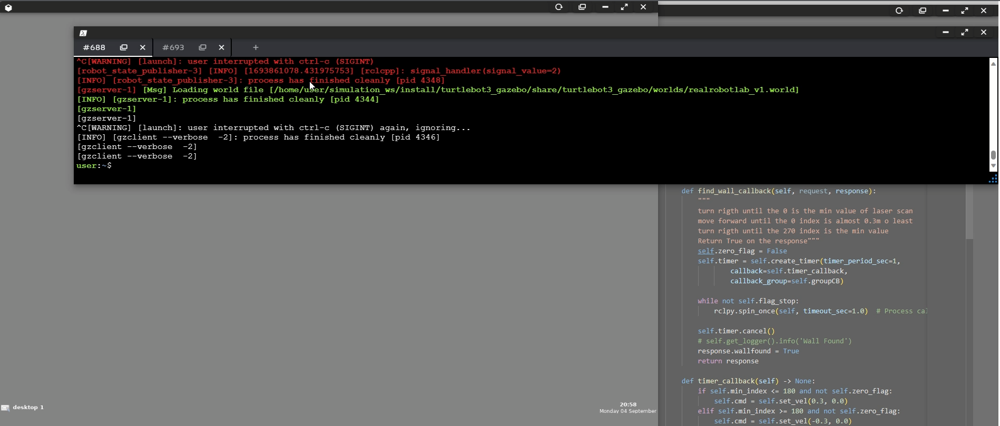
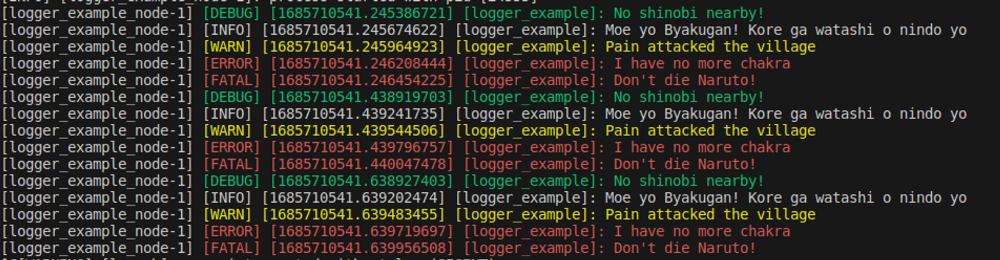

# ROS2 Basics in 5 Days: Course Projec

In this Project we learn the basics of ROS2 using Python.

- Topics
- Services
- Actions

All the thing write below is based on the https://app.theconstructsim.com/


[](attachments/ROS_project_simulation.mp4)


# Basics and fundamentals II

## What is a package?

In ROS2, packages organize all the files that a specific program contains, including CPP and Python files, configuration files, launch files, and parameters files. Python packages contain Python executables and have a specific structure of files and folders, including package.xml, setup.py, setup.cfg, and a directory with the same name as the package. Some packages might contain extra folders, such as the launch folder for launch files.

Every Python package will have the following structure of files and folders:

- **`package.xml`** - File containing meta-information about the package (maintainer of the package, dependencies, etc.).
- **`setup.py`** - File containing instructions for how to compile the package.
- **`setup.cfg`** - File that defines where the scripts will be installed.
- **`/<package_name>`** - This directory will always have the same name as your package. You will put all your Python scripts inside this folder. It already contains an empty `__init__.py` file by default.

To create a package we need to go a folder where we want to work, normally is called `ros2_ws` but we can call like we want. To create a package we have to options:

- Python
- C++

Here we will focus on python.

```bash
ros2 pkg create --build-type ament_python <package_name> --dependencies <dependencies>
```

After create a package is a good idea build that package.

```bash
colcon build
source install/setup.bash
```

For don’t write this every time, we can create an alias on the bash to with one word do that.

```bash
nano ~/.zshrc o nano ~/.bashrc
```

```bash
alias  build_source="colcon build && source install/setup.zsh" # zsh
alias  build_source="colcon build && source install/setup.bash" # bash
```

---

To know if the package was successfully created we can verify the package on ros2

```bash
ros2 pkg list | grep my_package
```

The project can have a lot of packages, and when you try to build, this take a long time to compile, so, if we made a change only in 1 package, we can compile only this.

```bash
colcon build --packages-select <package_name>
```

---

❗_**Always when you create a package and create a node,**_ _**we need to edit the [setup.py](http://setup.py) , add the new folders and executables.**_

```python
from setuptools import setup
#=====================
# New imports
import os
from glob import glob
#=====================

package_name = 'my_package'

setup(
    name=package_name,
    version='0.0.0',
    packages=[package_name],
    data_files=[
        ('share/ament_index/resource_index/packages',
            ['resource/' + package_name]),
        ('share/' + package_name, ['package.xml']),
				#==========================================================
				#========== New folders ===================================
        (os.path.join('share', package_name), glob('launch/*.launch.py'))
				#==========================================================
    ],
    install_requires=['setuptools'],
    zip_safe=True,
    maintainer='aleamar264',
    maintainer_email='alejandroamar66@gmail.com',
    description='Tutorial from theconstructsim (ROS2 Basics in 5 days)',
    license='TODO: License declaration',
    tests_require=['pytest'],
    entry_points={
        'console_scripts': [
						#=====================================
						# New executables
						#=====================================
            'simple_node = my_package.simple:main'
        ],
    },
)
```

---

## Topics

Topics is one of the way that ROS communicate between nodes. Imagine a Topic as a pipe through which information flows, a channel where nodes can read or write information. Those have a lot of different types of messages:

- geometry_msgs/msg/Twist
- sensor_msgs/msg/Battery
- etc …

### Commands

**Help:** **************`ros2 topic -h`**************

_**List: `ros2 topic list`**_

_**Found specific topic: `ros2 topic list | grep /cmd_vel`**_

_**Info: `ros2 topic info /cmd_vel`**_

_**Echo: `ros2 topic echo /cmd_vel`**_

***Pub: `ros2 topic pub /cmd_vel geometry_msgs/msg/Twist* linear: {x: 0.1, y: 0.0, z: 0.0}, angular: {x: 0.0, y: 0.0, z: 1.0}}"`**

With the flag —once we only once send a command

To continue with topics we need to know about the interfaces :

- **Messages:** Can be found as `.msg` files. They are simple text files that describe the fields of a ROS message. You can use them to generate source code for messages.
- **Services:** Can be found as `.srv` files. They are composed of two parts: a request and a response. Both are message declarations.
- **Actions:** Can be found as `.action` files. They are composed of three parts: a goal, a result, and feedback. Each part contains a message declaration.

### Messages

### commands

_**Show:**_ `ros2 interface show geometry_msgs/msg/Twist`

_**Prototype:**_ `ros2 interface proto geometry_msgs/msg/Twist`

```python
"linear:
  x: 0.0
  y: 0.0
  z: 0.0
angular:
  x: 0.0
  y: 0.0
  z: 0.0
"
```

---

## Custom Interfaces

It’s always recommended use the interfaces provides by ROS, but if you need your own interface you can create your own.

This should be create like a package on C++ (cmake)

## Example

```bash
ros2 pkg create --build-type ament_cmake custom_interfaces --dependencies rclcpp std_msgs
```

```bash
cd ~/ros2_ws/src/custom_interfaces
mkdir msg
```

```bash
int32 year
int32 month
int32 day
```

CmakeList.txt

```
find_package(ament_cmake REQUIRED)
find_package(rclcpp REQUIRED)
find_package(std_msgs REQUIRED)
find_package(rosidl_default_generators REQUIRED)
rosidl_generate_interfaces(${PROJECT_NAME}
  "msg/Age.msg"
)
```

_**package.xml**_

```xml
<build_depend>rosidl_default_generators</build_depend>
<exec_depend>rosidl_default_runtime</exec_depend>
<member_of_group>rosidl_interface_packages</member_of_group>
```

---

## Services

> Like Topics, Services are also a method of communication between nodes for ROS2. So, to understand them better, compare them with something you already know. Topics use the **publisher-subscriber** model. On the other hand, Services use a **call-response** model. As you saw, you can subscribe a node to a Topic to receive particular information with continuous updates. At the same time, a Service only provides data when called explicitly by a Client. __*theconstructsim*__

### Commands

**_Show_:**`ros2 interface show <service_name>`

**Type:**`ros2 service type <service_name>`

**_List_**: `ros2 service list`

_**Send data:**_ `ros2 service call <service_name> <service type> <value>`

The service have two sites on the srv file

```bash
<request>
---
<response>
```

_**The services have two methods, servers and clients. The server wait for some client to execute a specific action.**_

If you use an custom interface, when you call the service, this should be the service **_type_**

### Async vs Sync Services client in ROS2

The async call don’t block the code.

> On the other hand, a **synchronous client will block the calling thread when sending a request until a response has been received from the server. After that, nothing else can happen on that thread during the call. ***theconstructsim***

---

## Complex node

## **Executors**

An executor controls the threading model used to process Callbacks. Callbacks are work units like Subscription Callbacks, Timer Callbacks, Service Callbacks, etc.

You will find two types of executors:

- **SingleThreadedExecutor**: This is a simple executor. It runs the Callbacks in the main thread (the one that calls `executor.spin()`).
- **MultiThreadedExecutor**: It allows multiple threads to run Callbacks in parallel.

You have used only **MutuallyExclusiveCallbackGroup** Callback Groups. This is because they are the default type in ROS2. However, there is another type called **ReentrantCallbackGroup**.

The main difference is:

- **`ReentrantCallbackGroup`**: Any Callback inside this group can be executed in parallel if there are enough threads. For example, if you add three Callbacks inside the same **ReentrantCallbackGroup** and have **two threads**, you can simultaneously execute **TWO** of the **THREE** Callbacks.
- **`MutuallyExclusiveCallbackGroup`**: All the Callbacks inside this group will only be executed one by one in that group, no matter how many threads you have. For example, if you have **three Callbacks inside this group** and **three threads**, only **ONE Callback at a time will be executed**.

---

## Actions

Actions are similar to _**services**_ but with the difference that actions can be cancelled while are executed and this can also give feedback.


> The node that provides the Action functionality has to contain an _**Action Server.**_

> The node that call the Action functionality has to contain an _**************Action client.**************_

## Commands

_**List:**_ `ros2 action list`

_**Get data:**_ `ros2 action info <action>`

With -t we can see the data from the action: `ros2 action info <action> -t`

_**Saw the data from the action**_: `ros2 interface show <result from get data>`

_**Send data**_: `ros2 action send_goal <action_name> <action_type> <value>`

To see the feedback:

`ros2 action send_goal -f <action_name> <action_type> <value>`

## Create an Action Interface

- Create an action folder in your _**custom_interface**_ pkg
- Create your `<interface_name>.action`

```
int32 secs #Data
---
string status #Status
---
string feedback #Feedback
```

### Modify CMakeLists.txt

```
rosidl_generate_interfaces(${PROJECT_NAME}
  "action/Move.action"
)
```

```
find_package(action_msgs REQUIRED)
find_package(rosidl_default_generators REQUIRED)
```

### Modify package.xml

---

```
<depend>action_msgs</depend>
<depend>rosidl_default_generators</depend>
```

```
<member_of_group>rosidl_interface_packages</member_of_group>
```

---
## Debugging Tools

The logs have different levels, like:

- DEBUG
- IN
Example of debug (Code level)

## tf2_tools_view_frames

This program create a PDF file in the directory where it is run.

```bash
ros2 run tf2_tools view_frames
```

```bash
frames_2023-06-02_13.17.18.gv  frames_2023-06-02_13.17.18.pdf  ros2_ws
```

This tool is useful because it allows you to see the connection between each frame and determine if a transform is not well executed.

## ROS2 DOCTOR

> What happens when your ROS2 setup is not working as expected? Here you use ROS2's great tool, `ros2 doctor`.
>
> This powerful tool reviews the total ROS2 setup from the platform, versions, network, environment, etc., in addition to giving you a proper diagnosis with precautions, errors, and possible reasons for problems.
>
> Don't forget that `ros2doctor` belongs to the `ros2cli` package, so you will need to have it installed to use it. ***theconstructsim***

